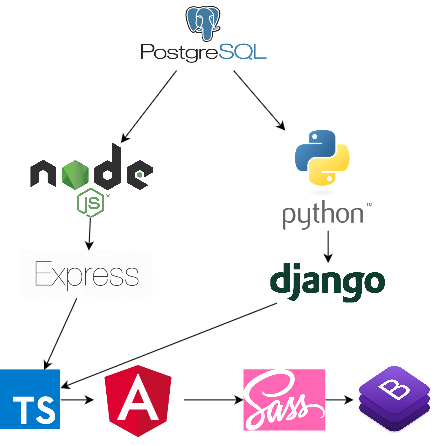

# Technology Description

## Front-End
For our front-end technologies we will be using Angular, TypeScript, Sass (SCSS) and possibly Bootstrap.

### Angular
We will be using [Angular](https://angular.io/) as our front-end framework. Angular is an open-source platform and framework for developing front-end component-based single page web applications. We are choosing Angular based on the following advantages:
* Stability: Angular is supported and maintained by Google’s Long-Term Support, the stability of Angular is predictable and reliable.
* Libraries: Angular has a variety of libraries to help us implement our services such as routing and data manipulation. 
* Component-Based: The architecture of Angular application is component-based. The code are encapsulated in components with proper hierarchy so that it makes the application more easy to maintain and understand. 
* Consistency: Using Angular could maintain the code consistency for future updates.
* Reusability: Angular encapsulates the code into components, and the components highly reusable across the application. There is no need to write duplicated code. 
* Testing: Angular supports unit testing with Jasmine, and the component structure makes the unit testing more clear and efficient.

### TypeScript
Since we will be using Angular as our front-end framework, we will be using the [TypeScript superset language](https://www.typescriptlang.org/) to program all front-end user interactivity. TypeScript has the following advantages.
* TypeScript is easy to read and understand.
* TypeScript could help us reduce the type related bugs.
* TypeScript includes the Object Oriented Programming (OOP) features.
* TypeScript supports interfaces, generics, inheritance, and method access modifiers. 
* TypeScript supports function overloading. We can overload different implementations of a function based on the parameters. 

### Sass (SCSS)
We will be using the [Sass preprocessor language](https://sass-lang.com/) to write our CSS code using the SCSS syntax. This will allow us to take advantage of the expanded capabilities of the Sass language which would not be available with regular CSS, such as variables, mixins, functions, conditionals and loops.

### Bootstrap
We are considering using the [Bootstrap CSS library](https://getbootstrap.com/) as our responsive CSS component library. This will save us time building boilerplate CSS for our components and making our components responsive as we will be able to take advantage of the prewritten responsive classes and helper classes which come with Bootstrap. If we use Bootstrap in combination with Sass then we can selectively include the Bootstrap components and helper classes which we require for the purposes of our project.

## Back-End
For our back-end technologies, we are currently weighing the pros and cons between either using Node.js and a framework such as Express and possibly a more full-featured MVC framework such as Sails or using Python with Django.

### Node.js
[Node.js](https://nodejs.org/en/) is an open source JavaScript runtime evironment for JavaScript which allows JavaScript to be used as a back-end/server-side language. Since TypeScript is a superset of JavaScript, it could also be used to write Node.js code.

The pros of using Node.js include:
* Using Node.js would allow us to use the same programming language, TypeScript, on both the front-end and back-end which would mean that it would not be necessary for team members to learn a second programming language.
* Node.js has high performance and speed, making Node.js web applications run fast.
* There are many Node.js libararies available through NPM which would serve most of the needs of our application.
* The Braintree payment system develops primarily for Node.js.
* The same Jasmine framework which is used for testing Angular applications could be used to test the Node.js code as well.

The cons of using Node.js include:
* Some Node.js web frameworks are less mature than frameworks in other languages which can result in less sophisticated documentation and more bugs.

#### Express
[Express](https://expressjs.com/) is a lightweight, minimalist, unopinionated web framework for Node.js. If we were to use Node.js then we would either be using Express or a more full-featured and opinionated web framework which would likely be based on Express.

The pros of using Express on its own include:
* Express is fast and lightweight.
* Express is unopinionated which would allow for flexibility in how we structure our back-end.

The cons of using Express on its own include:
* Express is minimalist so many features which would be included in a more fully featured framework would not be included in Express which would mean that we would need to find additional libraries to add on many features.
* Express is unopinionated which would mean that we would need to devise our own structure for our back-end.

#### Sails
[Sails](https://sailsjs.com/) is the most popular MVC framework for Node.js. It was built on Express and was designed to emulate the MVC pattern of frameworks such as Ruby on Rails or Django. By using Sails, we would be able to use Node.js with a more opinionated and fully featured framework.

The pros of using Sails include:
* Sails is an opinionated framework which would mean that we would not need to devise our own structure for the back-end.
* Sails includes an Object-Relational Mapper called Waterline which would allow us to interface with the database while avoiding writing SQL queries.
* Sails includes built-in security features.

The cons of using Sails include:
* Sails is a newer framework so the documentation is not as comprehensive as an older framework such as Django.
* Sails does not include built-in user authentication so it would be necessary to use a separate library such as Passport.js.
* The Waterline ORM has received some criticism for not being as easy to use as other ORMs.
* Sails is not a very mature framework so the documentation is not very comprehensive and there are not as many tutorials available as there are for more mature frameworks.

### Python
Python is an open-source, general purpose programming language which can be used as a server-side language for web applications using a framework such as Django or Flask.

The pros of using Python include:
* The code is clean and simple since it eliminates many of the symbols used in other programming languages, making it easy to read, understand and learn.
* There are many Python libraries available through the PIP package manager which would serve most of the needs of our application.
* Python web frameworks such as Django and Flask are very mature and trusted in the web community and have extensive documentation and tutorials available.

The cons of using Python include:
* Some team members would need to learn Python.
* Python is slower than Node.js.
* We are not certain that we have found suitable Python libraries for country blocking payments and carded detection for detecting credit card fraud.
* The Braintree payment system develops for Python as a secondary language.

#### Django
[Django](https://www.djangoproject.com/) is a mature, robust, full-featured MVC/MTV framework for Python. If we were to use Python, it would likely be to take advantage of the features included in Django.

The pros of using Django include:
* Django is an opinionated framework which would mean that we would not need to devise our own structure for the back-end.
* Django includes an extremely easy to manage Object-Relational Mapper which would allow us to interface with the database while avoiding writing SQL queries.
* Django includes many very good security features which account for many common security mistakes.
* Django includes very easy user authentication out of the box, which would avoid the need to find a user authentication library.
* Django includes email features out of the box, which would avoid the need to find an email library.
* Django includes form validation features out of the box, which would avoid the need to code form validation from scratch.
* Django includes an admin panel out of the box which could be used as a starting point for the admin panel which would be required for the client to update the website.
* Django is a very mature and trusted framework with few bugs and extremely comprehensive documentation and many tutorials available.

The cons of using Django include:
* Django may be bloated for our purposes given the number of features it includes out of the box.

## Database

### SQL
We will be using SQL for our database language as we feel that we should have a relational database for an ecommerce site, which would have relational data.

#### PostgreSQL
For our database technology we are considering using [PostgreSQL](https://www.postgresql.org/). PostgreSQL has the following advantages:
* PostgreSQL is an object-relational programming language which allows for the definition of objects and table inheritance for more complex data structures.
* PostgreSQL Supports NoSQL features and datatypes such as JSON and XML.
* PostgreSQL is ACID compliant and prevents data corruption to preserve the integrity of data.
* PostgreSQL offers support for JavaScript and Python and works well with Django.

